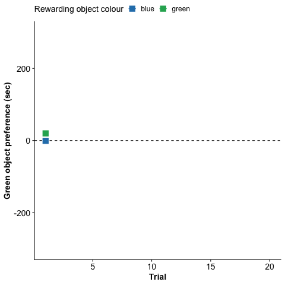

--- 
title: "Analysis for 'Biases in learned foraging preferences for coloured objects in Trinidadian guppies'"
author: "Wyatt Toure"
date: "Date of last update: `r Sys.Date()`"
site: bookdown::bookdown_site
documentclass: book 
bibliography: [book.bib, packages.bib]
biblio-style: apalike
link-citations: yes
description: ""
---

# Background

This site contains the code, model outputs, data tables, and residual diagnostics for the analyses demonstrated in the manuscript 'Bias in the shift of foraging preference for coloured objects in Trinidadian guppies, *Poecilia reticulata*'. 

The raw data used to conduct these analyses are available at the [github repository for this site](https://github.com/wyatt-toure/colour-learning-project-analysis/blob/main/data/experiment-2-master-sheet-clean.csv). 

The raw R code to produce the analysis is
available [here](https://github.com/wyatt-toure/colour-learning-project-analysis/blob/main/01-main-analysis.Rmd).

