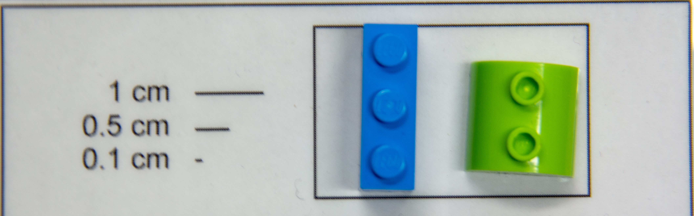

<div class="topnav">
  <a href="index.html">Guppy colour learning project site</a>
    <a href="https://github.com/wyatt-toure/guppy-colour-learning-project" style = "float: right;">GitHub</a>
    <a href="analysis.html" style = "float: right;">Analysis</a>
    <a class="active" href="methods.html" style = "float: right;">Methods</a>
    <a href="index.html" style = "float: right;">Home</a>
</div>

***

## Overview 

This page contains detailed protocols for the experiment in <span style="text-decoration:underline">'Colour biases in learned foraging preferences in Trinidadian guppies'</span>. For this experiment, we wanted to determine whether object preferences were plastic for both green and blue objects in Trinidadian guppies. Given these colours differ in their foraging relevancy for guppies we wanted to determine whether the shift in preference would be unconstrained. 

Our protocol aimed to manipulate object preferences for the green and blue objects (Fig 1) of individual guppies by manipulating their foraging experiences with these objects. This was done by providing food reinforcement for approaching one of the two objects.

On the first trial, guppies were placed in the test tank with both objects but empty food strips to measure preferences at a baseline. Training then occurred once daily between 10h00 to 16h00 for 20 days constituting 20 trials. During training, the location of the rewarding object (left or right) was randomized across days and individuals. That is, only the object’s appearance provided a reliable cue to food location. On the 21st day, an unreinforced ‘probe’ test was given where new duplicates of the objects were presented with empty plastic strips attached to them. This unreinforced trial (trial 21) was used to assess whether learning had occurred. At test, an equal number of individuals were presented with the formerly-rewarded object on the left and right side of the tank. 

***

## Objects 

```{r lego-objects-figure, echo=FALSE, out.width="50%", fig.cap="The two objects used in the experiment. Blue-trained guppies were trained to the left object and green-trained guppies were trained to the right object. The manufacturer’s colour name for the blue object is ‘bright blue’ (hex #1E5AA8, Lego® colour ID 23) and for the green object is ‘bright green’ (hex #58AB41, Lego® colour ID 37)."}

```

***

## Tests

<video width="60%" height="auto" controls>
                <source src="images/example-test-trial.mp4" type="video/mp4">
            </video>

</br>

For the initial and final tests guppies were presented with the green and blue objects with empty food strips attached to them. You can see an example of this above. The following protocol was used for testing:

1.	We transferred the guppy from the home tank to the test tank where the water level was 8 cm via a white opaque plastic cup where the green and blue objects had already been placed.
2.	Guppies were allowed to acclimate in a 20 cm tall, open-ended glass holding cylinder (7 cm diameter) after being transferred into the test tank for 120 seconds.
3.	After acclimation the release glass was lifted and the guppies given 5 minutes to move about the tank and feed from the objects. At this point the experimenter (MWT) left the room.
4. After the 5 minutes the guppy was transferred back to the home tank via the white opaque plastic cup.

**Tank Dimensions:** Length: 50.8 cm, Width: 25.4 cm

***

## Training

Guppies were rewarded for either foraging from either the blue object or the green object, forming the two experimental treatments, blue-rewarded and green-rewarded. The food reward was a gelatin mixture of flake food which was placed on the back of the objects facing away from the guppy so that the rewarding object had to be approached and investigated for the food reward to be discovered. The protocol for training was essentially the same as that for testing:

1.	We transferred the guppy from the home tank to the test tank where the water level was 8 cm via a white opaque plastic cup where the green and blue objects had already been placed. A food strip with a gelatine, flake food, brine shrimp reward mixture on it was attached depending on the rewarding object treatment the guppy was in.
2.	Guppies were allowed to acclimate in a 20 cm tall, open-ended glass holding cylinder (7 cm diameter) after being transferred into the test tank for 120 seconds.
3.	After acclimation the release glass was lifted and the guppies given 5 minutes to move about the tank and feed from the objects. At this point the experimenter (MWT) left the room.
4. After the 5 minutes the guppy was transferred back to the home tank via the white opaque plastic cup.

**Tank Dimensions:** Length: 50.8 cm, Width: 25.4 cm

### Food strips

The food strips that were attached to the objects were made with the following protocol: 

1. Pour 50 mL of water into a 100 mL beaker.
2. Add a pinch of Tetramin flake food to the water and stir.
3. Add a packet of Knox gelatin to the water and stir for 15 seconds, then wait another 15 seconds.
4. Use a transfer pipette to transfer the food mixture from the beaker onto strips of plastic.
5. Spread another pinch of flake food on top of the food mixture on the plastic strips.
6. Wait one hour for food to fix onto the plastic strips

*** 

<div class="tocify-extend-page" data-unique="tocify-extend-page" style="height: 0;"></div>
