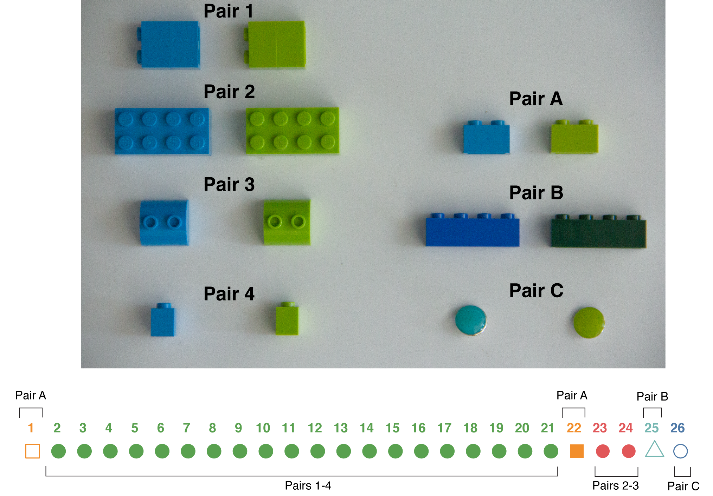

Date of this version: `r format(Sys.Date(), '%b %d %Y')`

## Project goal

A reviewer of a project of ours on colour learning says the following:

>The critical problem of this study is the presence of covariation between (at least) three features of the object stimulus, its colour, its size, and its shape. Therefore, it is not possible to conclude whether the observed difference in the learned preference between the two stimuli was due to the colour or to the shape or something else.

In order to address this point we are re-doing the study with this critique
addressed. We are conducting a study where the goal is to determine whether
guppies can change their preference for a coloured object, regardless of its
colour. Guppies are trained to green and blue objects that differ only in their
colours and not also their sizes and shapes (Figure \@ref(fig:figure-1)).

***

## Protocol overview

In this overview steps 1 - 3 are largely similar to experiment 1. This time the
experiment is done with a large variety of objects that only differ in their
colour. Steps 4 - 6 are additional trials for this second experiment so that, in
addition to making sure learning is specific to colour, we also see how robust
learning to colour is across different objects of similar colours.

1. *Initial test*: 1 unreinforced preference trial with object pair A
2. *Training*: 20 reinforced trials with object pairs 1-4
3. *Final test*: 1 post-training, reinforced preference trial with object pair A 
4. *Refresher trials*: Two reinforced trials with object pairs 2 and 3
5. *Generalization 1*: 1 unreinforced preference trial with object pair B
6. *Generalization 2*: 1 unreinforced preference trial with object pair C

During training, on any given day all guppies will get reinforced for visiting
the same object pair. The presentation of the four training object pairs will
have a randomized order that is the same for all guppies.

Generalization 1 refers to a generalization to different colours of Lego
material whereas Generalization 2 refers to generalization to completely
different objects (green and blue disks).

```{r figure-1, echo=FALSE, out.width="75%", fig.cap="The 7 pairs of objects for the experiment as well as an experimental timeline. The numbered object pairs are used for training while the lettered object pairs are used for testing. The experimental timeline represents the order of the trials. The open orange square at trial 1 represents the initial test which is done with object pair A. The filled green circles represent the 20 training trials (trials 2-21). The filled orange square is the final test trial which is done with object pair A. The 2 red circles represent the refresher trials which are done with object pairs 2 and 3 (I picked these with a random number generator between 1 and 4). The open cyan triangle represents generalization 1 which is done with objcet pair B. The open blue circle is generalization 2 which is done with objcet pair C"}

```

***

## Detailed protocol

In this section I provide step by step instructions on how to perform an
experiment for the day. Mina, I will provide a screen share video of how to do
everything in EthoVision to get the data too. I can also show you later in the
week how to run the trials.

### Overview

Briefly you will be doing the following. First you need to make the food strips
and then wait one hour for them to fix onto the strips. Then you run the trials
with the fish. Each trial lasts 5 minutes. Guppies are tested and trained in the
same order every day.

Throughout all trials the side of the tank the rewarding object is on should be
switched. I have written an R script that has randomly assigned individuals to
treatments as well as which side should be rewarded during all of training. 

The script ensures on any given day the position of the object is random but
across all trials the number of left reinforced and right reinforced trials is
even across guppies on any given day as well within an individual guppy across
all days. Consult this sheet when performing the experiment to know which
objects go where for which fish on any particular day.

After performing the trials for the day you transfer the video files from the SD
card on the camera and into the correct folder on the computer. Finally, you
will use EthoVision to extract the positional data from the video files (this is
a very quick process).

Some additional details. Guppies should only be fed in their home tank every two
days during this experiment. This is to encourage motivation to perform the
task. For test trials we have duplicates of the training objects which should be
used instead of the training objects.


### Step 1 - Food strips

The first thing you need to do during a training day is to make food strips. 16
strips will be prepared, one for each guppy. The food strips that are attached
to the objects are made with the following protocol:

1.  Pour 50 mL of water into a 100 mL beaker.
2.  Add a pinch of Tetramin flake food and decapsulated brine shrimp egg to the
    water and stir.
3.  Add a packet of Knox gelatin to the water and stir for 15 seconds, then wait
    another 15 seconds.
4.  Use a transfer pipette to transfer the food mixture from the beaker onto
    strips of plastic.
5.  Spread another pinch of flake food on top of the food mixture on the plastic
    strips while it is still wet.
6.  Wait one hour for food to fix onto the plastic strips

### Step 2 - Performing the test or training trials

If the current trial is a training trial you do the following:

1.  Transfer the guppy from the home tank to the test tank which has been filled
    with water from several guppy home tanks to a level of 8 cm via a white
    opaque plastic cup where the green and blue objects have already been placed
    into the glass holding cylinder. The objects should be placed on their
    designated velcro piece which are each 6 cm from the side of the tank with
    one on the left and right end of the tank. The two objects are 38 cm apart.
    A food strip should be attached to the back of the rewarding object for that
    guppy. Consult the data sheet to confirm which guppy is rewarded to which
    object and which side of the tank the rewarding object should be placed.
2.  Guppies should be allowed to acclimate in a 20 cm tall, open-ended glass
    holding cylinder (7 cm diameter) after being transferred into the test tank
    for 120 seconds.
3.  After acclimation the release glass should be lifted and the guppies given 5
    minutes to move about the tank and feed from the objects. Leave the room
    once you have lifted the cup and come back after 5 minutes and 20 seconds.
4.  Transfer the guppy back to the home tank via the white opaque plastic cup.

If the trial is a test trial you do the above EXCEPT there is no need to add
food to a plastic strip. Instead use never before used blank plastic strips that
I provide. On test trial days you therefore do not need to wait an extra hour.


    