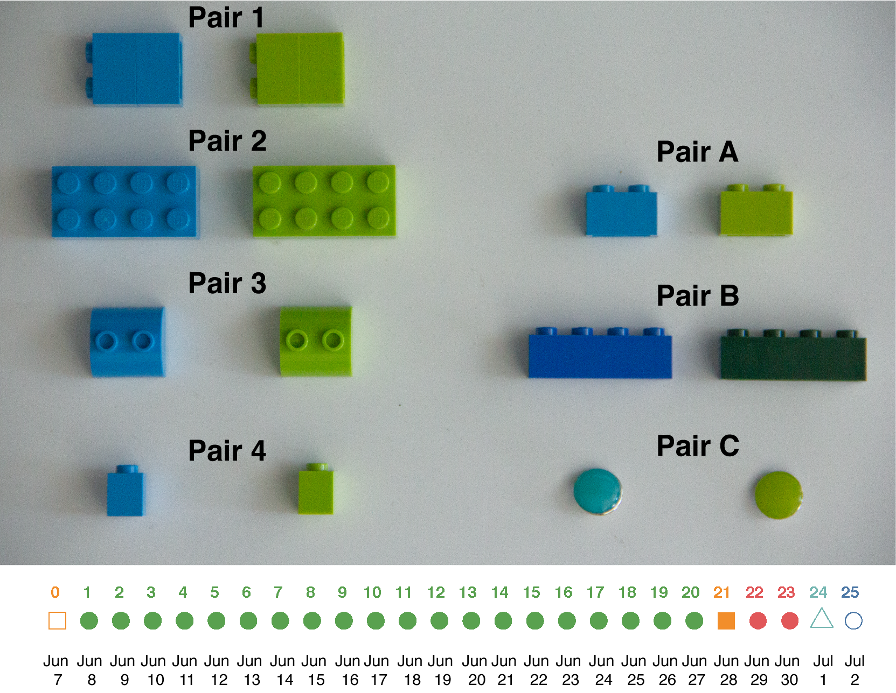

Date of this version: `r format(Sys.Date(), '%b %d %Y')`

## Project goal

A reviewer of a project of ours on colour learning says the following:

>The critical problem of this study is the presence of covariation between (at least) three features of the object stimulus, its colour, its size, and its shape. Therefore, it is not possible to conclude whether the observed difference in the learned preference between the two stimuli was due to the colour or to the shape or something else.

In order to address this point we are re-doing the study with this critique in
mind. We are conducting a study where the goal is to determine whether guppies
can change their preference for a coloured object, regardless of its colour.
Guppies are trained to green and blue objects that differ only in their colours
and not also their sizes and shapes (Figure \@ref(fig:figure-1)).

***

## Protocol overview

In this overview steps 1 - 3 are largely similar to experiment 1. This time the
experiment is done with a large variety of objects that only differ in their
colour. Steps 4 - 6 are additional trials for this second experiment so that, in
addition to making sure learning is specific to colour, we also see how robust
learning to colour is across different objects of similar colours.

1.  *Initial test*: 1 unreinforced preference trial with object pair A. An empty
    food strip is attached to each object.
2.  *Training*: 20 reinforced trials with object pairs 1-4. A rewarded food strip
    is attached to the rewarded object, and an empty food strip to the other
    object.
3.  *Final test*: 1 post-training, unreinforced preference trial with object pair
    A. An empty food strip is attached to each object.
4.  *Refresher trials*: 2 reinforced trials with object pairs 2 and 3
5.  *Generalization 1*: 1 unreinforced preference trial with object pair B. An
    empty food strip is attached to each object.
6.  *Generalization 2*: 1 unreinforced preference trial with object pair C. An
    empty food strip is attached to each object.

During training, on any given day all guppies will get reinforced for visiting
the same object pair. The presentation of the four training object pairs will
have a randomized order that is the same for all guppies.

Objects are cleaned by rinsing with water conditioned with SeaChem Prime between
trials. For example, if a single training object was used, a scratch could mean
that particular object was treated differently from other objects, so we would
be looking at learning about a scratch, not colour.

Generalization 1 refers to a generalization to different colours of Lego
material whereas Generalization 2 refers to generalization to completely
different objects (green and blue disks).

```{r library-prep2, include=FALSE}
library(ggplot2)
library(scales)
library(cowplot)
```

```{r data-prep, include=FALSE}
trial.type = c(
  "Initial Test", "Training","Training",
"Training", "Training", "Training", "Training", "Training","Training","Training",
"Training","Training","Training","Training","Training","Training","Training","Training",
"Training", "Training", "Training", "Final Test", "Refresher", "Refresher", "Generalization 1","Generalization 2")

trial = c(0, 1,2,3,4,5,6,7,8,9,10,
          11,12,13,14,15,16,17,18,19,20,
          21,22,23,24,25)

trial.state = c(
  "Initial","Initial","Initial",
"Initial","Initial","Initial","Initial",
"Training","Training","Training","Training","Training",
"Training","Training","Training","Training","Training",
"Training","Training","Training","Training","Final Test",
"Refresher","Refresher","Generalization 1","Generalization 2"
)

# Tableau colour palettes
blue = "#4e79a7"
green = "#59a14f"
brown = "#9c755f"
orange = "#f28e2b"
yellow = "#edc948"
grey = "#bab0ac"
red = "#e15759"
purple = "#b07aa1"
cyan = "#76b7b2"
pink = "#ff9da7"
```

```{r data-prep2, include=FALSE}
timeline.df = data.frame(trial.type, trial, trial.state)

trial.type.colors <- c(orange, cyan, blue, orange,  red,  green)
trial.type.shapes <- c(15, 2, 1, 0, 16, 19)
```

```{r data-prep3, include=FALSE}
positions <- c(0.5, 0.5, 0.5, 0.5, 0.5, 0.5)
directions <- c(1, 1)

line_pos <- data.frame(
    "trial"=unique(timeline.df$trial),
    "position"=rep(positions, length.out=length(unique(timeline.df$trial))),
    "direction"=rep(directions, length.out=length(unique(timeline.df$trial)))
)

timeline.df <- merge(x=timeline.df, y=line_pos, by="trial", all = TRUE)
timeline.df <- timeline.df[with(timeline.df, order(trial, trial.type)), ]

text_offset <- 0.1

timeline.df$trial_count <- ave(timeline.df$trial==timeline.df$trial, timeline.df$trial, FUN=cumsum)
timeline.df$text_position <- (timeline.df$trial_count * text_offset * timeline.df$direction) + timeline.df$position

head(timeline.df)
```

```{r, include=FALSE}
# Initial ggplot version of timeline commented out. If you see this Hi! :) 
ggplot(timeline.df,aes(x=trial,
                       y=0,
                       color=trial.type,
                       shape = trial.type,
                       label = trial)
       ) +
  scale_color_manual(values=trial.type.colors, drop = FALSE) +
  scale_shape_manual(values = trial.type.shapes) +
  theme_cowplot() +
  geom_hline(yintercept=0, color = "white", size=0.3) +
  geom_point(aes(y=0), size=4) +
  theme(
    axis.line.y=element_blank(),
    axis.text.y=element_blank(),
    axis.title.x=element_blank(),
    axis.title.y=element_blank(),
    axis.ticks.y=element_blank(),
    axis.text.x =element_blank(),
    axis.ticks.x =element_blank(),
    axis.line.x =element_blank(),
    plot.title = element_text(hjust = 0.5,  vjust = -30),
    legend.position = "none"
                ) +
  guides(colour = guide_legend(nrow = 2)) +
  geom_text(aes(label=trial),hjust=.7, vjust=-2,size=3, fontface = "bold") +
  labs(color = "Trial Type", shape = "Trial Type")
```


```{r figure-1, echo=FALSE, out.width="75%", fig.cap="The 7 pairs of objects for the experiment as well as an experimental timeline. The numbered object pairs are used for training while the lettered object pairs are used for testing. The experimental timeline represents the order of the trials. The open orange square at trial 0 represents the initial test which is done with object pair A. The filled green circles represent the 20 training trials (trials 1-20). The filled orange square is the final test trial which is done with object pair A. The 2 red circles represent the refresher trials which are done with object pairs 2 and 3 (I picked these with a random number generator between 1 and 4). The open cyan triangle represents generalization 1 which is done with object pair B. The open blue circle is generalization 2 which is done with object pair C"}

```

***

## Detailed protocol

In this section I provide step by step instructions on how to perform an
experiment for the day.

### Overview

Briefly the protocol involves the following: First you need to make the food
strips and then wait one hour for them to fix onto the strips. Then you run the
trials with the fish. Each trial lasts 5 minutes. Guppies are tested and trained
in the same order every day.

Throughout all trials the side of the tank the rewarding object is on should be
switched. I have written an [R script]() that has produced a data sheet which
randomly assigned individuals to treatments as well as which sides of the tank
should be rewarded during training for each guppy.

The script ensures on any given day the position of the object is random but
across all trials the number of left reinforced and right reinforced trials is
even across guppies on any given day as well within an individual guppy across
all days. Consult this sheet when performing the experiment to know which
objects go where for which fish on any particular day.

After performing the trials for the day you transfer the video files from the SD
card on the camera and into the `C://Users/Reader Lab/2-colour-learning-experiment-2/videos/` 
folder on the desktop. Finally, you will use EthoVision to extract the
positional data from the video files.

Some additional details. Guppies should only be fed Tetramin flake food in their
home tank every three days during this experiment. This is to encourage
motivation to perform the task.

### Step 1 - Food strips

The first thing to do during a training day is to make food strips. 16 strips
are prepared, one for each guppy. The food strips that are attached to the
objects are made with the following protocol:

1.  Pour 50 mL of conditioned water into a 100 mL beaker.
2.  Add half a serving of decapsulated brine shrimp egg to the water and stir
    then add a pinch of Tetramin flake food and stir.
3.  Add a packet of Knox gelatin to the water and stir for about 15 seconds or
    until the powder fully dissolves, then wait another 15 seconds.
4.  Use a transfer pipette to transfer the food mixture from the beaker onto
    strips of plastic.
5.  Spread another pinch of flake food on top of the food mixture on the plastic
    strips while it is still wet.
6.  Wait one hour for food to fix onto the plastic strips

### Step 2 - Preparing the SD card 

Before you start performing the trials the SD card needs to have footage from
the previous day cleared up.

1. Open the folder navigation menu by clicking the folder icon on the bottom left of the screen 
2. Under `Computer` click `Removable Disk (L:)`
3, Double click `MP_ROOT` then `100ANV01` 
4. Scroll down to the files that have a date modified date of today
5. Hold down `CTRL` while selecting the files that have a type of `MP4 Video`
6. Right click and select Delete 
7. Again, under `Computer` click `Removable Disk (L:)`
8. Go to `PRIVATE` then `AVCHD`then `BDMV` then `STREAM`
9. Scroll down to the files that have a date modified date of today
10. Hold down `CTRL` while selecting the files that have a type of `MP4 Video`
11. Right click and select `Delete` 
12. Under `Computer` **right click** `Removable Disk (L:)` and select eject
13. Take the SD card out of the card reader and put it into the camera

### Step 3 - Performing the test or training trials

If the current trial is a training trial you do the following:

1.  Place the test tank on the designated sharpie lines on the lab bench
2.  Fill the test tank with water from several home tanks to the 6 cm line using
    the aquaneering rack tank.
3.  Transfer the guppy from the home tank to the test tank which has been filled
    with water from several guppy home tanks to a level of 6 cm via a white
    opaque plastic cup where the green and blue objects have already been placed
    into the test tank. The objects should be placed on their designated velcro
    piece which are each 6 cm from the side of the tank with one on the left and
    right end of the tank. The two objects are 38 cm apart.
4.  Dip the food strip in some water to remove excess flakes. Keep dipping until
    the strip does not shed flakes upon being dipped in water (about 8 to 10
    dips)
5.  Attach a food strip to the back of the correct rewarding object for that
    trial using blunt tweezers. Consult the data sheet to confirm which guppy is
    rewarded to which object and which side of the tank the rewarding object
    should be placed.
6.  Gently pour the guppy into a 20 cm tall, open-ended glass holding cylinder
    (7 cm diameter). Allow the guppy to acclimate in the holding cylinder
    for 120 seconds.
7.  Press the red Record button on the remote for the camera
8.  After acclimation the release glass should be slowly lifted and the guppies
    given 5 minutes to move about the tank and feed from the objects. Set a
    timer for 5 minutes and 20 seconds and leave the room once you have lifted
    the cup. Come back after 5 minutes and 20 seconds.
9.  Stop the video recording using the remote.     
10.  Transfer the guppy back to the home tank via the white opaque plastic cup.
11. Repeat steps 3 to 8 for all guppies.
12. Remove the objects from the test tank and empty the water into the sink.

If the trial is a test trial you do the above EXCEPT there is no need to add
food to a plastic strip. Instead use never before used blank plastic strips that
I provide. On test trial days you therefore do not need to wait an extra hour.

### Step 4 - EthoVision

1.  Carefully remove the SD card from the camera and place it into the card
    reader on the wet lab computer.
2.  Navigate to the video files which are located in `L://MP_ROOT/`
3.  Copy the 16 `.mp4` video files from the trials of the current day into a
    folder named after the trial number (*e.g.*, `trial-x/`) found within the
    `C://Users/Reader Lab/2-colour-learning-experiment-2/videos/` folder.
4.  Rename the `.mp4` files based on the IDs of the fish. Each video file should
    be named after a specific fish.
5.  Open EthoVision XT 11.5
6.  Under New experiment select `New from template`
7.  Select `Use a custom template`
8.  Select `Browse...` and navigate to `C://Users/Reader Lab/2-colour-learning-experiment-2/trial-2/trial-2.evxt`
9.  Click `OK`
10. Click `Browse...` and navigate to `C://Users/Reader Lab/2-colour-learning-experiment-2/` and name the file `trial-x` where x is
    the number of the trial for that day (this can be found on the data sheet).
11. Click the `Arena Settings` tab and select `Arena Settings 1`
12. Go to the panel on the right and right click `Background`. 
13. Navigate to the first video file for that day and click `Open`. 
14. Click `Grab` and make sure the arena graphics still line up then click `Validate Setup`. 
15. Click `Trial List`
16. Click `Add Trials` in the top left corner and add 16 trials
17. Click `Acquisition (0 acquired)`
18. Scroll through the video footage until the point where the release cylinder is removed from the tank 
19. Wait 20 seconds to allow the water to calm 
20. Click the small camera icon on the left of the `Playback Control` to set the background image. 
21. Click the red circle to start processing the video. 
22. Watch for any errors in tracking and make note of when these occur
23. Record whether the guppy eats from the rewarded object during the trial on the data sheet 
24. Click `...` next to Video under the Settings tab to the right
25. Select the next video
26. Repeat steps 18-25 for all videos 
27. Go to the trial list and fill in the variables
28. Perform track error correction
29. Under the `Analysis` tab go to the `Results` tab and click `Statistics & Charts`
30. Click `Calculate`
31. Under the `Export` tab click `Statistics`
32. Click `OK`, the default settings should be sufficient
33. Navigate to `C://Users/Reader Lab/2-colour-learning-experiment-2/trial-x/Export Files/`
34. Open Google chrome and click the third bookmark tab which contains the Google drive folder named `experiment-2-raw-data/`
35. Drag the raw data file `Statistics-trial-x` into the Google drive folder. 
36. Save EthoVision and close it. 


    